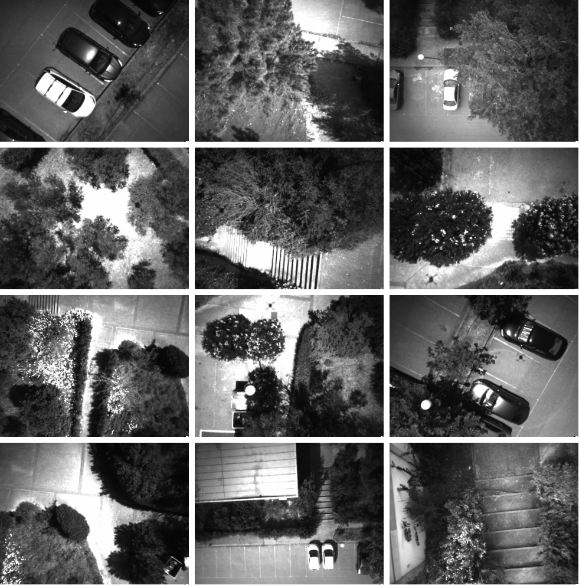
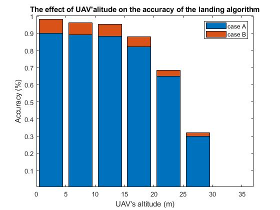

# UAV autonomous landing in unstructured terrains

## Intro

The technology of **unmanned aerial vehicles** (UAVs) has increasingly become part of many civil and research  applications in the <br />recent years. While navigating in remote environments, UAVs need to be capable of autonomously landing on complex terrains for<br /> security, safety and data acquisition reasons. This is extremely challenging as thestructure of these terrains is often unknown, and<br /> no prior knowledge can be leveraged. In this study, we present a vision-based autonomous landing system for UAVs equipped with<br /> a pair of *stereo cameras* and an *inertial measurement unit* (IMU).

## Pipeline

The landing site detection algorithm introduces and evaluates several factors including terrain’s *flatness*, *inclination* and *steepness*.<br /> Considering these features we compute map-metrics that are used to obtain a landing-probability map, based on which we detect<br /> candidate landing sites. The 3D reconstruction of the scene is  acquired by stereo processing and the pose of the UAV at any given<br /> time is estimated by fusing raw data from the inertial sensors with the pose obtained from stereo ORB-SLAM2. 

- System Overview: Stereo ORBSLAM2 continuously estimates the pose ofthe camera and a map of the environment. Using an<br /> UKF we fuse the ORBSLAM2 measurements with IMU data to further improve the accuracy of the estimatedpose. When <br />landing is needed, a stereo image pair of the scene the drone is insertedas input in the which outputs the most appropriate <br />site for landing on the image-frame.

<p align="center">

</p>

## How do I set up?

In our configuration we used DJI Matrice 100 with mounted DJI guidance system. Furthermore we use Raspberry Pi 4 as the<br />embedded computational unit. We use Robotic Operating System (ROS) as the middleware on the Raspberry Pi 4.

1. Build DJI [Guidance SDK](https://github.com/dji-sdk/Guidance-SDK-ROS)
2. Build DJI [Onboard SDK](https://github.com/dji-sdk/Onboard-SDK)
3. Build [ORB_SLAM2][https://github.com/raulmur/ORB_SLAM2] with ROS.
4. To build with ROS clone the repository into `catkin_ws`.

```
cd catkin_ws
catkin make --only-pkg-with-deps landing
```

## Results
Real-world trials demonstrate successful landing in unknown and complex terrains such as suburban and forest areas.

- **Landing Point Detection Overview**: The constructed map-metrics lead toa landing-probability map using a Bayes method.<br /> Landing candidate points areextracted  from  the  landing-probability  map  and  are  grouped  into  clusters.  Thecentroid of the <br />biggest cluster (blue cluster) is the selected landing site.

<p align="center">

</p>

- **Illustrations of real world trial** in dense wooded area. We demon-strate the resulting total score-image of the scene, <br />the detected landing point onthe image frame and the landing position of the UAV on the world frame.

<p align="center">

</p>

- A sample of the **dataset**.

<p align="center">

</p>

- The  **accuracy**  of  safe  landing  site  detection  as  a  function  of  the  UAV’saltitude. In case A (blue), the flatness and the steepness<br /> map-metrics are utilized.In case B (orange) we show the accuracy improvement by adding depth-varianceand inclination map<br /> metrics.
   
<p align="center">

</p>


