# VIDEO STABILIZATION

## Intro

 In this work two methods for video stabilization are implemented. In the first case the optical flow between the video frames is utilized and in the second case the edges are detected and an affine tranform is applied. 

## Lukas-Kanade

 To implement Lucas-Kanade algorith we calculate motion vector u(Vx, Vy) for each pixel. In summary, the vectors must sutisly the relations:

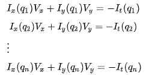

 Where Ix, Iy and It are the partial derivatives in terms of rows, columns and time respectively. W defines the size of the window in which the above calculations are made, assuming that within it the speed is constant. The above relations are written in the form of tables as, where:

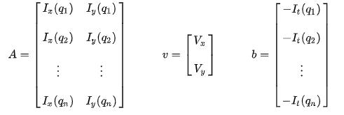

 

And finally:

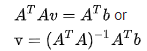

Where *A^T* is the the inverse matrix and *M = A^T A* is the second moment matrix. Analyzing from the relation above it follows that:

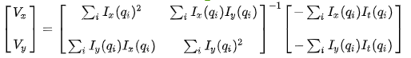

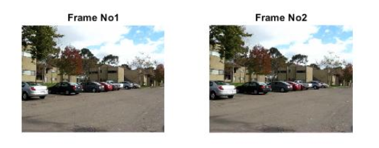

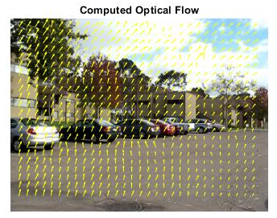

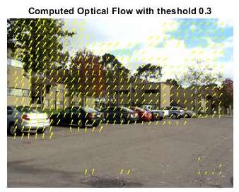
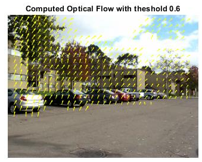

 To implement Lucas-Kanade algorith we calculate motion vector u(Vx, Vy) for each pixel. In summary, the vectors must sutisly the relations:

##Edge Detection

 For edge detection, the eigenvalues ​​are checked. Specifically, the eigenvalues of matrix *M = A^T A* ​​are compared with an applied threshold. If both values are large (greater than the threshold) we consider the specific pixel as ab edge. Respectively we can calculate the value:

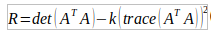

 where *k* is an empirical constant between 0.04 and 0.06. The value *R* is compared to a threshold and the values ​​that exceed it are the possible angles of the image. Because depending on the window w we select, the same angle may appear in many parts of the window, we select only the largest values ​​of *R* within the window.

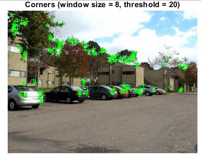

##Video Stabiliazation using optical flow

 Based on the calculated motion we can make a match of the two consecutive images. Specifically a point that was in position [x, y] based on the speed calculated in the next frame will be in position [x + u, y + v]. The transformation is done per pixel taking into account the optical flow from frame to frame using MatLab's interp2 function. This function calculates the interpolation between positions [x, y] and [x + u, y + v]. The resulting stabilized video is saved as stabilized_optical.avi

##Video Stabiliazation using affine model

 In this case, to stabilize the video, we compute the edges to each frame. Specifically an edge that was in position [x, y] based on the motion calculated in the next frame will be in position [x + u, y + v]. So having enough points-edges we can calculate the affine transformation so that:

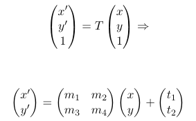
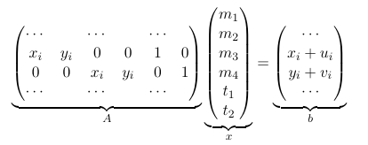

 The solution of the system *Ax = b* in the sense of least squares is obtained from the pseudo-inverse of table A and is as follows

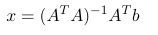

 After calculating the transformation, MatLab affine2d and imwarp functions are used to export the fixed frame. The resulting stabilized video is saved asstabilized_affine.avi

